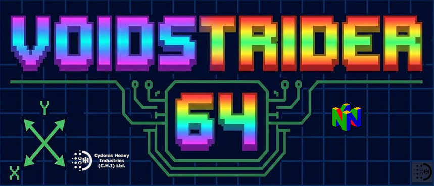
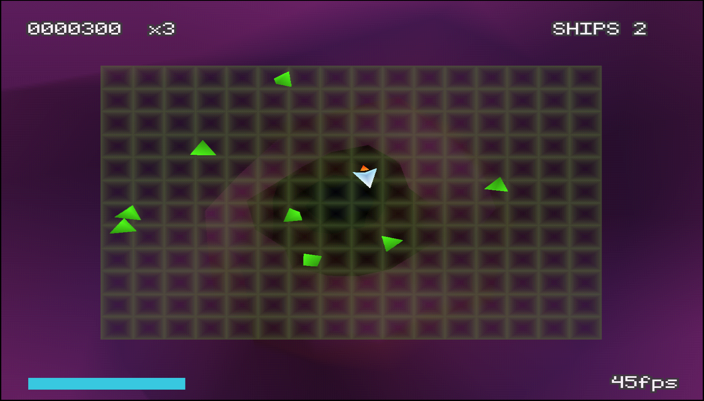

# VoidStrider64 🎮

   [](https://github.com/Naereen/badges/) <br>
 <br>
<div align="center">
</img>


**A procedurally-generated twin-stick arena shooter for the Nintendo 64.** <br>

<br>
</div>
Geometry Wars' arena combat, staged inside a Space Giraffe wormhole: a
semi-transparent, deformable neon grid floats over an infinite, undulating
tunnel that the whole scene appears to fly through. Every mesh, texture,
palette and sound effect is generated procedurally at runtime — the ROM ships
as code, math, and a handful of hand-composed tracker modules.

Built with [libdragon](https://github.com/DragonMinded/libdragon) (preview
branch) and [tiny3d](https://github.com/HailToDodongo/tiny3d), in C.

> **Requires the Expansion Pak (8MB).** This is a hard requirement — the game
> checks at boot and halts with an error screen without it.
 
 <br>

 <br>

## Controls

| Input | Action |
|---|---|
| Analog Stick | Move (full analog, 360°) |
| C-Buttons | Fire in 8 directions (combos give diagonals; hold to stream) |
| Z | Smart bomb (when the meter is full — bottom-left, pulses cyan) |
| Start | Restart after game over |

Kill Wanderers, collect the shards they drop to build your multiplier
(1×–10×), and don't let the multiplier decay. Full-size Wanderers split in
two when destroyed. Shard pickups also speed up your bomb recharge.

## Building

Requires Python3+ & Docker (the toolchain runs in the official libdragon image — no host
toolchain needed):

```bash
git clone --recurse-submodules https://github.com/Cyd0n1a/VoidStrider64.git
cd VoidStrider64
bash build.sh        # -> voidstrider64.z64
```

`build.sh` copies the vendored libdragon patches from `patches/libdragon/`
into the submodule (fgeom/rspq_profile backports that tiny3d needs at the
pinned SHA), installs libdragon in the container, builds tiny3d, then builds
the ROM. Output is logged to `build.log`.

Tested in [Ares](https://ares-emu.net/) (Homebrew Mode), Gopher64, and on real hardware
via flashcart. PAL and NTSC both target 320×240 @ 60fps.

## Design

The full game design document lives in
[VOIDSTRIDER64_GDD.md](VOIDSTRIDER64_GDD.md). Current state tracks roughly
milestone M5 (combat core+) of the plan described there:

- ✅ M0 — procedural wormhole tunnel (ring conveyor, seeded LFO shapes, HSV palette drift)
- ✅ M1 — transparent spring-deformable grid + procedural player ship
- ✅ M2 — C-button combat, Wanderer enemies, shards/multiplier, smart bomb, procedural SFX synth
- ✅ M3 — full bestiary (Seeker, Swarmer, Turret, Pulsar, Snake) + spawn director
- ✅ M4 — .xm tracker soundtrack via xm64, beat-synced visuals. Wavetable music in core gameplay loop.
- ✅ M5 — seeds UI, accessibility options, EEPROM high scores.
- ⚪ M6+ — Polishing, various improvements, and REDACTED further (secret! 🤔) features! 😜
- ⚪ M7+ — Was eaten by a small wiggly grue... 😉
  
## License

© 2026 [Amanda Hariette-Scott](https://bsky.app/profile/cydonis.co.uk) & [Cydonis Heavy Industries](https://cydonis.co.uk). All Rights Reserved.

libdragon and tiny3d are the work of their respective authors under their
respective licenses (see submodules).

 <br>

```
/*
          _       _        _          _                  _                _                    _             _        
        /\ \     /\ \     /\_\       /\ \               /\ \             /\ \     _           /\ \          / /\      
       /  \ \    \ \ \   / / /      /  \ \____         /  \ \           /  \ \   /\_\         \ \ \        / /  \     
      / /\ \ \    \ \ \_/ / /      / /\ \_____\       / /\ \ \         / /\ \ \_/ / /         /\ \_\      / / /\ \__  
     / / /\ \ \    \ \___/ /      / / /\/___  /      / / /\ \ \       / / /\ \___/ /         / /\/_/     / / /\ \___\ 
    / / /  \ \_\    \ \ \_/      / / /   / / /      / / /  \ \_\     / / /  \/____/         / / /        \ \ \ \/___/ 
   / / /    \/_/     \ \ \      / / /   / / /      / / /   / / /    / / /    / / /         / / /          \ \ \       
  / / /               \ \ \    / / /   / / /      / / /   / / /    / / /    / / /         / / /       _    \ \ \      
 / / /________         \ \ \   \ \ \__/ / /      / / /___/ / /    / / /    / / /      ___/ / /__     /_/\__/ / /      
/ / /_________\         \ \_\   \ \___\/ /      / / /____\/ /    / / /    / / /      /\__\/_/___\    \ \/___/ /       
\/____________/          \/_/    \/_____/       \/_________/     \/_/     \/_/       \/_________/     \_____\/        
                                                                                                                      
[@@@@@@@@@@@@@@@@@@@@@@@@@@@@@@@@@@@@@@@@@@@@@@@@@@@@@@@@@@@@@@@@@@@@@@@@@@@@@@@@@@@@@@@@
[@@@@@@@@@@@@@@@@@@@@@@@@@@@@@@@@@@@@@@@@@@@@@@@@@@@@@@@@@@@@@@@@@@@@@@@@@@@@@@@@@@@@@@@@
[@@@@@@@@@@@@@@@@@@@@@@@@@@@@@@@@BBB@@@@@@@@@@@@@@@@@@@@@@@@@@@@@@@@@@@@@@@@@@@@@@@@@@@@@
[@@@@@@@@@@@@@@@@@@@@@@@@@@@@@@@.    @@@@@BBBBB@@@@@@@@@@@@@@@@@@@@@@@@@@@@@@@@@@@@@@@@@@
[@@@@@@@@@@@@@@@@@@@@@@@@@@@@@@@,.  _@@@@@           "=@@@@@@@@@@@@@@@@@@@@@@@@@@@@@@@@@@
[@@@@@@@@@@@@@@@@@@@@@@@@@@@@@@@@@@@@@@@@@                "+@@@@@@@@@@@@@@@@@@@@@@@@@@@@@
[@@@@@@@@@@@@@@@@@@@@@@@@@@@@@@@@@@@@@@@@@                    '4@@@@@@@@@@@@@@@@@@@@@@@@@
[@@@@@@@@@@@@@@@@B@@@@@@@@@@@@@@@@@@@@@@@@                       "B@@@@@@@@@@@@@@@@@@@@@@
[@@@@@@@@@@@@@"      9@@@@@@@@B.     'B@@@@@@@ga____.               %@@@@@@@@@@@@@@@@@@@@
[@@@@@@@@@@@@         9@@@@@@@.       .@@@@@@@@@@@@@@g__              %@@@@@@@@@@@@@@@@@@
[@@@@@@@@@@@@         @@@@@@@@.       .@@@@@@@@@@@@@@@@@@@_,            0@@@@@@@@@@@@@@@@
[@@@@@@@@@@@@@_    . j@@@@@@@@g_.    _@@@@@@@@@@@@@@@@@@@@@@g_.          '@@@@@@@@@@@@@@@
[@@@@@@@@@@@@@@@@@@@@@@@@@@@@@@@@@@@@@@@@@@@@@@@@@@@@@@@@@@@@@@_           @@@@@@@@@@@@@@
[@@@@@@@@@@@@@@@@@@@@@@@@@@@@@@@@@@@@@@@@@@@@@@@@@@@@@@@@@@@@@@@@           @@@@@@@@@@@@@
[@@@@@@@@@@@@@@@@@@@@@@@@@@@@@@@@@@@@@@@@@@@@@@@@@@@@@@@@@@@@@@@@@a          @@@@@@@@@@@@
[@@@@@@@@@@@@@@@@@@@@@@@@@@@@@'  _.   %@@@@@@@@@@@@@P'""""`@@@@@@@@g.        .@@@@@@@@@@@
[@@@@@@@@@@@@@F      B@@@@@@F .+@@@@_.  B@@@@@@@@@@@|      @@@@@@@@@A.         @@@@@@@@@@
[@@"   \@@@@@         @@@@@@  !@@@@@@;  .@@@T.---- Vg_.   j@'----..B@j         [@@@@@@@@@
[@@.   ,@@@@@         &@@@@B   B@@@@P   .@@@||      @@|   @@|     [|@@,         @@@@@@@@@
[@@@@@@@@@@@@@,      j@@@@@@,          .J@@@||      @@|   @@|     [|@@]         @@@@@@@@@
[@@@@@@@@@@@@@@@@@@@@@@@@@@@@g_       _@@@@@||      --    --      [|@@@         [@@@@@@@@
[@@@@@@@@@@@@@@@@@@@@@@@@@@@@@@@ggggg@@@@@@@||     ___'   ___     [|@@@         [@@@@@@@@
[@@@@@@@@@@@@@@@@@@@@@@@@@@@@@@@@@@@@@@@@@@@||      --.   --,     [|@@@         [@@@@@@@@
[@@@@@@@@@@@@@@@@@@@@@@@@@@@@@P"     "%@@@@@||      @@|   @@|     [|@@@         [@@@@@@@@
[@@@@@@@@@@@@@N     "@@@@@@@F   ...    '@@@@||      @@|   @@|     [|@@@         @@@@@@@@@
[@@"   \@@@@@"        @@@@@@  .g@@@@_.  .@@@1.===== P.    "@L.====='@@)         @@@@@@@@@
[@@.    @@@@@         [@@@@B  !@@@@@@!  '@@@@@@@@@@@|      @@@@@@@@@@P         ,@@@@@@@@@
[@@@ggg@@@@@@B       _@@@@@@   0@@@@f   !@@@@@@@@@@@ggggggg@@@@@@@@@@          @@@@@@@@@@
[@@@@@@@@@@@@@@@~~~J@@@@@@@@@_         A@@@@@@@@@@@@@@@@@@@@@@@@@@@@"         j@@@@@@@@@@
[@@@@@@@@@@@@@@@@@@@@@@@@@@@@@@g~~~~~@@@@@@@@@@@@@@@@@@@@@@@@@@@@@@          _@@@@@@@@@@@
[@@@@@@@@@@@@@@@@@@@@@@@@@@@@@@@@@@@@@@@@@@@@@@@@@@@@@@@@@@@@@@@@N          _@@@@@@@@@@@@
[@@@@@@@@@@@@@@@@@@@@@@@@@@@@@@@@@@@@@@@@@@@@@@@@@@@@@@@@@@@@@@W"         .+@@@@@@@@@@@@@
[@@@@@@@@@@@@@W"'  "4@@@@@@@@@@P"   "4@@@@@@@@@@@@@@@@@@@@@@@P"          .g@@@@@@@@@@@@@@
[@@@@@@@@@@@@?        @@@@@@@@'       '@@@@@@@@@@@@@@@@@@@@"            ,@@@@@@@@@@@@@@@@
[@@@@@@@@@@@@         [@@@@@@B.       .@@@@@@@@@@@@@@@@P"            ..g@@@@@@@@@@@@@@@@@
[@@@@@@@@@@@@B        @@@@@@@@_       J@@@@@@@@@@@=>'               ,g@@@@@@@@@@@@@@@@@@@
[@@@@@@@@@@@@@@~___~g@@@@@@@@@@g~___~@@@@@                        _@@@@@@@@@@@@@@@@@@@@@@
[@@@@@@@@@@@@@@@@@@@@@@@@@@@@@@@@@@@@@@@@@                    ._/@@@@@@@@@@@@@@@@@@@@@@@@
[@@@@@@@@@@@@@@@@@@@@@@@@@@@@@@@@@@@@@@@@@                 __g@@@@@@@@@@@@@@@@@@@@@@@@@@@
[@@@@@@@@@@@@@@@@@@@@@@@@@@@@@@@P"""9@@@@@           ..__@@@@@@@@@@@@@@@@@@@@@@@@@@@@@@@@
[@@@@@@@@@@@@@@@@@@@@@@@@@@@@@@@.    @@@@@l__-___gg@@@@@@@@@@@@@@@@@@@@@@@@@@@@@@@@@@@@@@
[@@@@@@@@@@@@@@@@@@@@@@@@@@@@@@@g___g@@@@@@@@@@@@@@@@@@@@@@@@@@@@@@@@@@@@@@@@@@@@@@@@@@@@
[@@@@@@@@@@@@@@@@@@@@@@@@@@@@@@@@@@@@@@@@@@@@@@@@@@@@@@@@@@@@@@@@@@@@@@@@@@@@@@@@@@@@@@@@
*/
```
